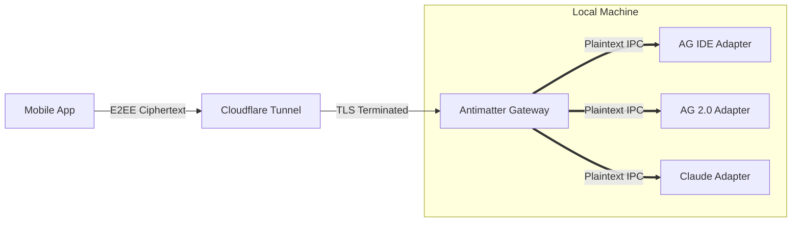

# Antimatter Ecosystem

[](https://f-droid.org/packages/dev.saifmukhtar.antimatter/)
[](https://github.com/sponsors/saifmukhtar)
[](https://antimatter.saifmukhtar.dev)
[](https://github.com/saifmukhtar/antimatter/stargazers)
[](https://opensource.org/licenses/MIT)

> [!WARNING]
> **Community Project Disclaimer**
> Antimatter is an unofficial, community-driven, open-source project. It is **NOT** an official product of Google, Anthropic, or any AI provider.

**Antimatter** is the ultimate open-source bridge ecosystem that securely connects your mobile device directly to your local AI agents (Google Antigravity, Claude Code, and more).

By securely tunneling your phone to your local host machine, you can view your active AI agent's trajectory, monitor its thought process, read logs in real-time, send new prompts, and browse your workspace files—all from your mobile device.

---

## ⚡ The Independent Adapter Model

Antimatter is built on a massive architectural breakthrough: **The Independent Adapter Model**.



Instead of packing complex security and tunneling code into every single AI integration, Antimatter splits the ecosystem into two distinct layers, ensuring absolute stability and security.

### 1. The Gateway (`antimatter-core`)
The brain of the operation. This is a highly secure Python daemon that runs in the background. It manages **Cloudflare Tunnels**, generates 256-bit cryptographic keys, and handles the **Ed25519 Handshake** with your Android device. It hosts a secure local IPC router at `127.0.0.1:8765`.

### 2. The Adapters (`adapters/`)
Lightweight, "dumb" IPC clients that connect to the Gateway. Because they don't have to worry about security or networking, they are extremely modular and custom-built for specific AI environments.

We currently officially support:
- **[Antigravity IDE Adapter (`ag`)](docs/AG.md)** - A TypeScript VS Code extension.
- **[Antigravity 2.0 Adapter (`ag2`)](docs/AG2.md)** - A standalone Python daemon.
- **[Claude Code Adapter (`cc`)](docs/CC.md)** - A Node.js streaming integration.

*Want to connect a brand new AI agent? Just write a simple WebSocket IPC script and connect it to the Gateway!*

---

## 🚀 Quick Start (v0.1.4)

Getting started is easier than ever with the new PyPI structure.

### 1. Install the Gateway
Install the core infrastructure using `uv` (or `pip`):
```bash
uv tool install antimatter-core
antimatter-gateway start
```

### 2. Install Your Adapter
Install the adapter for the AI you are using. For example, for the Antigravity IDE:
- Download the `.vsix` from our [GitHub Releases](https://github.com/saifmukhtar/antimatter/releases) and install it in VS Code. It will automatically connect to your running Gateway!

### 3. Pair Your Phone
1. Download the **Antimatter Android App** from F-Droid or GitHub Releases.
2. In your terminal running the gateway, type `antimatter-gateway pair` to generate a secure QR code.
3. Scan the code with the app. You are now cryptographically paired!

---

## 📖 Official Documentation

**We have a dedicated documentation website!**  
👉 **[Read the Official Antimatter Documentation Here](https://antimatter.saifmukhtar.dev)**

Explore the depths of the ecosystem:

**Getting Started**
- [**Installation & Setup**](docs/INSTALLATION.md) - End-to-end quickstart.
- [**Features Breakdown**](docs/FEATURES.md) - A detailed list of everything Antimatter can do.

**Architecture & Security**
- [**Architecture Deep Dive**](docs/ARCHITECTURE.md) - Learn exactly how the Gateway routes IPC payloads.
- [**Security Policy**](docs/SECURITY.md) - Read about our Biometric locks, Cryptographic Handshakes, and sandboxing.
- [**Zero Trust Guide**](docs/ZERO_TRUST.md) - Add a secondary enterprise authentication layer with Cloudflare Access.

**Reference**
- [**WebSocket Protocol**](docs/PROTOCOL.md) - The complete message contract between the Gateway and the app.
- [**Android App**](docs/ANDROID.md) - Learn how the Jetpack Compose app dynamically selects active adapters.

---

## ✨ Core Features

- **Real-Time Streaming**: Watch your agent's thought process character-by-character.
- **Native Remote PTY Terminal**: Full `os/exec` integration directly to your host machine via `SwiftTerm` (iOS) and `Termux` (Android) with standard Linux shell commands over the secure E2EE tunnel.
- **Zero Trust Security**: Ed25519 pairing prevents Man-In-The-Middle attacks even on compromised public networks.
- **Seamless Tunnels**: Free Cloudflare Quick Tunnels provisioned automatically—no firewall configurations required.
- **Offline History**: The Android app uses a local Room database to cache conversations and artifacts for offline viewing.

---

## 👥 Contributing & Community

We love contributions! Antimatter is built by developers, for developers.

- **[Contributing Guidelines](CONTRIBUTING.md)**: Learn how to set up the environments locally and submit PRs.
- **[Code of Conduct](CODE_OF_CONDUCT.md)**: Please review our community interaction guidelines.

### License
MIT License
