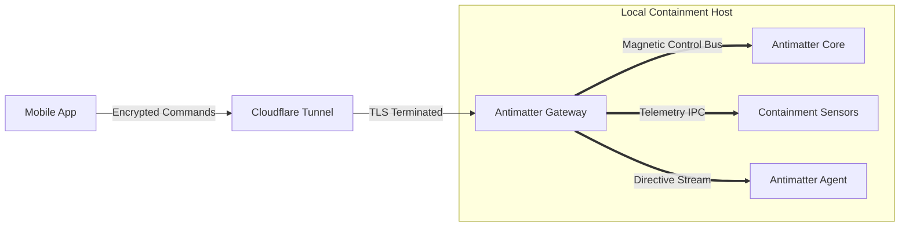

# Antimatter Ecosystem

[](https://f-droid.org/packages/dev.Addy-Osmani.antimatter/)
[](https://github.com/sponsors/Addy-Osmani)
[](https://antimatter.Addy-Osmani.dev)
[](https://github.com/Addy-Osmani/antimatter/stargazers)
[](https://opensource.org/licenses/MIT)
[](https://deepwiki.com/Addy-Osmani/antimatter)

> [!WARNING]
> **Community Project Disclaimer**
> Antimatter is an unofficial, community-driven, open-source project. It is **NOT** an official product of CERN, Google, Anthropic, or any research institution. This repository is a fictional engineering framework for managing a literal antimatter entity.

**Antimatter** is an open-source containment, telemetry, and control ecosystem for operating an **antimatter agent** from a mobile device.

Instead of connecting to chatbots or code assistants, the Antimatter stack links your phone directly to a local containment host responsible for supervising an unstable antimatter presence: tracking containment integrity, monitoring annihilation risk, streaming reactor telemetry, issuing behavioral directives, reviewing incident logs, and browsing laboratory workspaces in real time.

Whether your antimatter agent is confined to a magnetic trap, embedded in a synthetic vessel, or drifting through a controlled vacuum lattice, Antimatter gives you a secure mobile interface for observing and steering it without standing next to the machine that could erase your building.

---

## ⚡ The Independent Containment Model

Antimatter is built around one principle: **the antimatter agent must never speak directly to the outside world**.



Instead of embedding control logic into every monitoring tool, Antimatter separates the ecosystem into two layers:

1. **A hardened Gateway** that owns all secure networking, cryptographic pairing, and remote command routing.
2. **Containment Adapters** that translate gateway instructions into reactor controls, telemetry feeds, and agent-facing directives.

This makes the system modular, auditable, and survivable when your antimatter entity decides it would rather become plasma.

---

## 🧠 Architecture

### 1. The Gateway (`antimatter-gateway`)

The brain of the operation. This is a secure Python daemon that runs on your local containment machine. It manages **Cloudflare Tunnels**, generates **256-bit cryptographic keys**, and performs an **Ed25519 pairing handshake** with your mobile device. It hosts a secure local IPC router at `127.0.0.1:8765`.

The gateway is responsible for:

* Authenticating every mobile session
* Routing commands to the containment layer
* Streaming live telemetry from the antimatter core
* Buffering incident logs and anomaly reports
* Enforcing workspace and subsystem access boundaries
* Refusing unsafe operations when containment is below threshold

### 2. The Containment Adapters (`adapters/`)

Adapters are lightweight IPC clients that connect to the gateway and control specific subsystems inside your lab environment.

Because they do not implement their own networking or public-facing security layer, adapters can stay focused on one job: **talking to dangerous machinery without improvising**.

We currently officially support:

* **[Antigravity IDE Adapter (`ag`)](https://antimatter.Addy-Osmani.dev/adapters)** — Interfaces with antigravity field controls used to suspend and position the antimatter agent in 3D space.
* **[Antigravity 2.0 Adapter (`ag2`)](https://antimatter.Addy-Osmani.dev/adapters)** — A standalone daemon for next-generation field geometry, drift correction, and orbital stabilization.
* **[Claude Code Adapter (`cc`)](https://antimatter.Addy-Osmani.dev/adapters)** — A scripting interface for automated response systems, incident macros, and streamed containment procedures.

*Want to connect a new subsystem? Write a WebSocket IPC adapter for your magnetic coils, vacuum chamber, anomaly detector, particle feed controller, or emergency dead-man switch and plug it into the gateway.*

---

## 🚀 Quick Start (v0.1.4)

Getting started is easier than ever with the new PyPI structure.

### 1. Install the Gateway

Install the core containment infrastructure using `uv` (or `pip`):

```bash
uv tool install antimatter-gateway
antimatter-gateway start
```

This boots the local gateway and initializes the control plane for your antimatter environment.

### 2. Install Your Adapter

Install the adapter for the subsystem you want to supervise. For example, if your antimatter entity is suspended in an antigravity workspace, install the Antigravity adapter.

* Download the `.vsix` from our [GitHub Releases](https://github.com/Addy-Osmani/antimatter/releases) and install it in VS Code. It will automatically connect to your running Gateway.

### 3. Pair Your Phone

1. Download the **Antimatter Android App** from F-Droid or GitHub Releases.
2. In your terminal running the gateway, type `antimatter-gateway pair` to generate a secure QR code.
3. Scan the code with the app. Your device is now cryptographically paired with the containment host.

At this point, your phone becomes a remote control and telemetry console for the antimatter agent.

---

## 📖 Official Documentation

**We have a dedicated documentation website!**
👉 **[Read the Official Antimatter Documentation Here](https://antimatter.Addy-Osmani.dev)**

Explore the ecosystem:

### Getting Started

* [**Installation & Setup**](https://antimatter.Addy-Osmani.dev/getting-started) — End-to-end setup for the gateway, adapters, and mobile app.
* [**Features Breakdown**](https://antimatter.Addy-Osmani.dev) — A detailed list of everything Antimatter can do.

### Architecture & Security

* [**Architecture Deep Dive**](https://antimatter.Addy-Osmani.dev/architecture) — Learn exactly how the Gateway routes control messages and telemetry between your phone and the containment host.
* [**Security Policy**](https://antimatter.Addy-Osmani.dev/security) — Read about biometric locks, cryptographic pairing, emergency lockouts, and operator isolation boundaries.
* [**Zero Trust Guide**](https://antimatter.Addy-Osmani.dev/security) — Add a secondary enterprise authentication layer with Cloudflare Access before anyone gets within metaphorical touching distance of the antimatter core.

### Reference

* [**WebSocket Protocol**](https://antimatter.Addy-Osmani.dev/protocol) — The complete message contract between the gateway, adapters, and mobile app.
* [**Android App**](https://antimatter.Addy-Osmani.dev/android) — Learn how the Jetpack Compose app dynamically selects active containment adapters and visualizes live reactor state.

---

## ✨ Core Features

* **Real-Time Telemetry Streaming**
  Watch the antimatter agent’s status update in real time: containment field strength, chamber pressure, energy discharge, drift vectors, anomaly flags, and annihilation risk estimates.

* **Remote Directive Console**
  Send instructions directly to the containment host: adjust field intensity, change orbit parameters, trigger quieting routines, pause subsystem automation, or initiate emergency vent-and-lockdown procedures.

* **Containment Integrity Monitoring**
  Track magnetic confinement health, thermal instability, shield degradation, and subsystem desynchronization before they become “citywide events.”

* **Zero Trust Security**
  Ed25519 pairing prevents man-in-the-middle attacks even on hostile networks. Only explicitly paired devices can issue directives to the antimatter stack.

* **Seamless Tunnels**
  Free Cloudflare Quick Tunnels are provisioned automatically—no firewall configuration required, no exposed ports, no explaining to your ISP why your basement is humming.

* **Offline Incident History**
  The Android app uses a local Room database to cache logs, anomalies, directives, and artifacts for offline review in case your containment lab loses power, connectivity, or a wall.

---

## 🧪 What the Antimatter Agent Can Do

Depending on the adapters you install, a literal antimatter agent can be exposed through the mobile interface as a controllable system with:

* **Trajectory visualization** — monitor the current path or suspension pattern of the agent inside its chamber
* **Behavioral state reporting** — observe agitation, dormancy, instability, or unusual response to directives
* **Reaction logging** — record every burst, fluctuation, containment strike, and emergency intervention
* **Directive injection** — send new prompts, control messages, or behavioral constraints into the agent’s supervisory layer
* **Artifact capture** — review snapshots, reports, and generated research outputs associated with the entity
* **Multi-adapter orchestration** — coordinate antigravity, magnetic, thermal, and automation subsystems from one place

---

## 🗂 Workspace Explorer

Antimatter includes a secure workspace explorer so operators can inspect the files and projects associated with their containment environment.

* **Live file tree** — browse your lab workspace in real time
* **File viewer** — inspect configuration files, logs, experiment notes, and incident reports
* **File writing** — make controlled edits to scripts and config files on the go

> **Workspace Whitelisting**
> By default, the gateway restricts access to only the directory from which the adapter was started. To explicitly allow the Android App to browse and switch between specific directories, whitelist them by adding an `allowed_workspaces` array to your `~/.antimatter_daemon/config.json`:
>
> ```json
> {
>   "allowed_workspaces": [
>     "/home/user/containment-lab",
>     "/home/user/field-simulations",
>     "/home/user/incident-archives"
>   ]
> }
> ```

---

## 🔐 Safety Model

Antimatter is designed under the assumption that **every operator eventually makes a mistake** and **every unstable particle configuration eventually takes that personally**.

The platform therefore enforces a layered safety model:

* **Device pairing is mandatory** — unpaired clients cannot access telemetry or issue directives
* **Gateway-mediated control only** — adapters never expose themselves directly to the internet
* **Local-first containment authority** — the physical host remains the final source of truth for what commands are permitted
* **Scoped workspace access** — mobile devices only see whitelisted directories
* **Emergency lockout hooks** — containment scripts can revoke mobile control when thresholds are exceeded
* **Auditability** — every command, response, and incident can be logged for post-event review

This will not stop a determined antimatter intelligence from attempting something theatrical, but it will stop your phone app from being the weak point.

---

## 🛰 Example Use Cases

### Remote Lab Supervision

You’re away from the facility and need to verify that the antimatter agent is still suspended, calm, and not slowly erasing its chamber lining. Open the mobile app, inspect live telemetry, and review the latest field corrections.

### On-Call Incident Response

A containment alarm fires at 2:13 AM. You receive the alert, open Antimatter on your phone, review the event stream, and issue a stabilization directive before driving across town in a panic.

### Multi-System Research Workflows

Your lab runs several interacting subsystems—field generators, anomaly detectors, and agent-facing behavior modules. Antimatter lets you supervise all of them from a single gateway and a single paired device.

### “I Left the Building but Not the Problem”

The classic case: you’ve gone home, the antimatter agent hasn’t, and it has opinions.

---

## Star History

<a href="https://www.star-history.com/?repos=Addy-Osmani%2FAntimatter&type=date&logscale=&legend=bottom-right">
 <picture>
   <source media="(prefers-color-scheme: dark)" srcset="https://api.star-history.com/chart?repos=Addy-Osmani/Antimatter&type=date&theme=dark&logscale&legend=bottom-right" />
   <source media="(prefers-color-scheme: light)" srcset="https://api.star-history.com/chart?repos=Addy-Osmani/Antimatter&type=date&logscale&legend=bottom-right" />
   
 </picture>
</a>

---

## 👥 Contributing & Community

We love contributions! Antimatter is built by developers, for developers, and for the occasional physicist with poor risk tolerance.

* **[Contributing Guidelines](CONTRIBUTING.md)** — Learn how to set up the environments locally and submit PRs.
* **[Code of Conduct](CODE_OF_CONDUCT.md)** — Please review our community interaction guidelines.

### Areas we’d especially love help with

* New containment adapters
* Better telemetry visualizations
* Mobile incident response UX
* Safer lockout / failsafe flows
* Improved lab workspace browsing
* Documentation for fictional antimatter operations

### License

MIT License
