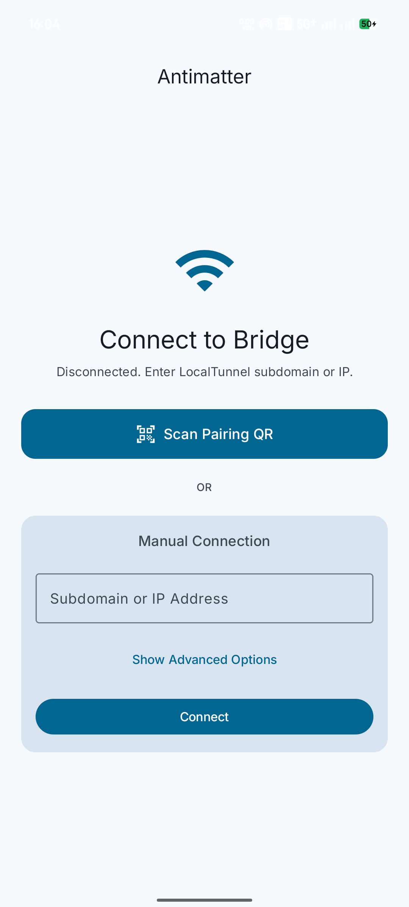
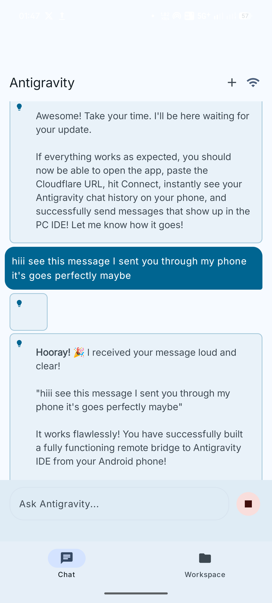
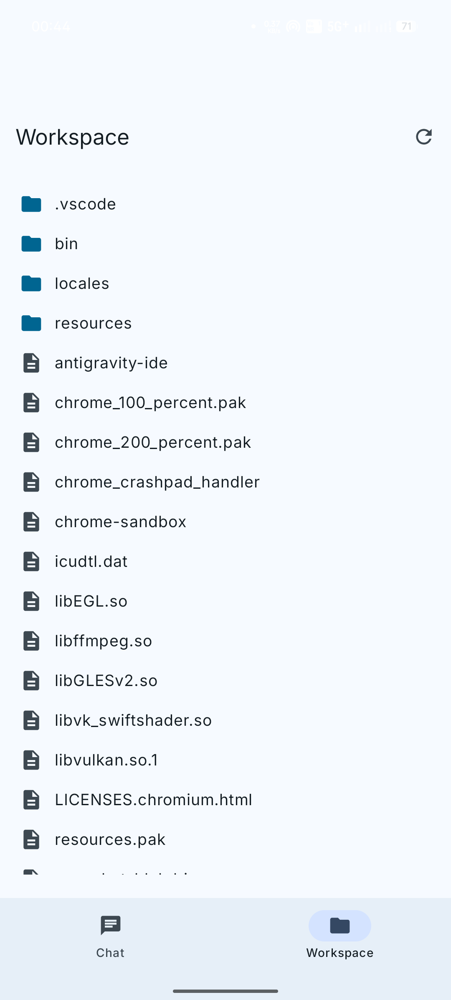
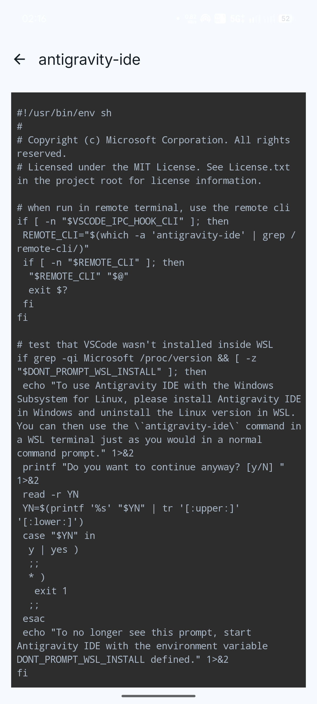
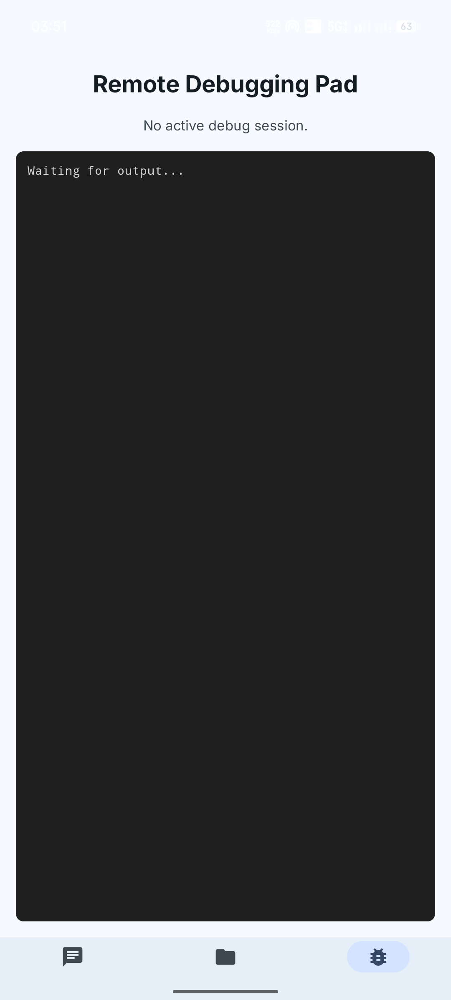
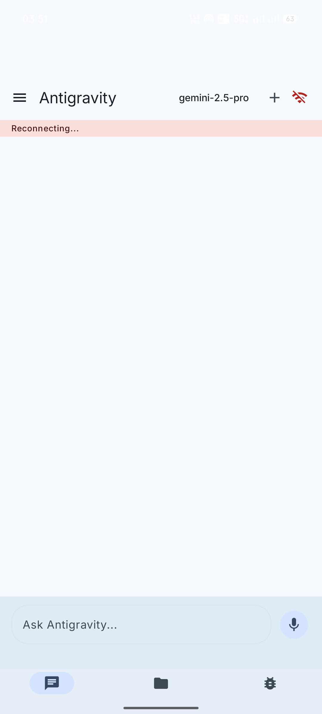

# Antimatter Companion App (Android)

<p align="center">
  
</p>

**Antimatter** is the companion mobile app for your live **Google AntiGravity IDE** session. It securely connects to the Antimatter Bridge extension running on your host machine, letting you manage your AI agent from anywhere.

*Note: This is an unofficial, open-source tool and is not affiliated with Google or the official AntiGravity IDE project.*

## What this App Does
This Android app connects via WebSocket to the Antimatter Bridge server on your host machine. It receives a live trajectory of your AntiGravity agent (including thoughts, tool calls, and outputs) and allows you to remotely control the agent from your phone. 

### Screenshots
<p align="center">
  
  
  
</p>
<p align="center">
  
  
  
</p>

## Features
- **Real-Time Agent Mirroring**: Watch your agent's thought process, tool executions, and file edits in real-time as they happen in your IDE.
- **Remote Control**: Send chat messages to your agent without being at your computer.
- **Review Edits**: Accept or reject code changes diffs directly from your phone.
- **Instant Pairing**: Just scan the QR code in VS Code to establish a secure WebSocket connection.
- **Zero Trust Security**: Built-in support for Cloudflare Zero Trust and Quick Tunnels. All connections are secured with a cryptographically generated 256-bit token.

## How to Connect
1. Ensure the **Antimatter Bridge** extension is installed and running in your AntiGravity IDE.
2. In VS Code, open the Command Palette and select `Antimatter: Show Pairing QR Code`.
3. Open this app on your Android device and tap **Scan Pairing QR**.
4. Scan the code. The app will automatically securely connect to your machine!

## Build Instructions (FOSS)
To build the fully open-source flavor of the app (which removes all proprietary Google Mobile Services and Firebase telemetry):
```bash
./gradlew assembleFossDebug
```

---
**Repository**: [github.com/saifmukhtar/antimatter](https://github.com/saifmukhtar/antimatter)
