# End-to-End Encryption (E2EE) Lifecycle

This diagram outlines the complete lifecycle of a secure Antimatter connection. It details how the Mobile Client securely discovers the local Gateway, authenticates its identity using Ed25519 signatures, performs an X25519 ECDH key exchange, and securely routes encrypted payloads to local adapters.

## The Zero-Knowledge Handshake & Routing Flow

```mermaid
sequenceDiagram
    autonumber
    
    %% Participants
    actor User
    participant Mobile as Mobile App (iOS/Android)
    participant CF as Cloudflare Tunnel
    participant Gateway as Antimatter Gateway
    participant Crypto as Core Crypto (Gateway)
    participant Adapter as Local Adapter (ag/ag2/cc)

    %% Step 1: Pairing & Discovery
    rect rgb(20, 40, 60)
        Note over User,Gateway: Phase 1: Pairing & Discovery
        Gateway->>Gateway: Generate Ephemeral X25519 Keypair
        Gateway-->>User: Print QR Code (url, token, x25519_pub)
        User->>Mobile: Scan QR Code / Paste Deep Link
        Mobile->>Mobile: Save connection parameters to Keychain
    end

    %% Step 2: Connection & Ed25519 Authentication
    rect rgb(60, 20, 60)
        Note over Mobile,Crypto: Phase 2: Ed25519 Authentication Challenge
        Mobile->>CF: Open WebSocket (WSS) w/ Bearer Token
        CF->>Gateway: Terminate TLS & Forward TCP
        Mobile->>Gateway: {"type": "AUTH_CHALLENGE", "challenge": "<uuid>"}
        Gateway->>Crypto: Sign challenge with Ed25519 Private Key
        Crypto-->>Gateway: Signature
        Gateway->>Mobile: {"type": "AUTH_RESPONSE", "signature": "<base64>"}
        Mobile->>Mobile: Verify signature using token (Ed25519 PubKey)
    end

    %% Step 3: E2EE Key Derivation
    rect rgb(20, 60, 40)
        Note over Mobile,Crypto: Phase 3: E2EE ECDH Key Derivation
        Mobile->>Mobile: Generate Ephemeral X25519 Keypair
        Mobile->>Gateway: {"type": "HELLO", "pubkey": "<mobile_x25519_pub>"}
        
        par Gateway Derivation
            Gateway->>Crypto: derive_keys(mobile_pub)
            Crypto->>Crypto: ECDH Shared Secret
            Crypto->>Crypto: HKDF-SHA256 (client-to-server) -> c2s_key
            Crypto->>Crypto: HKDF-SHA256 (server-to-client) -> s2c_key
        and Mobile Derivation
            Mobile->>Mobile: ECDH Shared Secret (using gateway_x25519_pub)
            Mobile->>Mobile: HKDF-SHA256 (client-to-server) -> c2s_key
            Mobile->>Mobile: HKDF-SHA256 (server-to-client) -> s2c_key
        end
    end

    %% Step 4: Encrypted IPC Routing
    rect rgb(60, 40, 20)
        Note over Mobile,Adapter: Phase 4: Encrypted Execution & Routing
        
        %% Client sending command
        Mobile->>Mobile: AES-GCM Encrypt Command (key=c2s_key, aad="cmd:")
        Mobile->>CF: {"iv": "...", "ct": "...", "aad": "cmd:v1:msg_id:1"}
        CF->>Gateway: Forward Ciphertext Payload
        Gateway->>Crypto: Decrypt using c2s_key & verify AAD
        Crypto-->>Gateway: Plaintext JSON (Command)
        Gateway->>Adapter: Route via Local IPC: {"type": "COMMAND", ...}
        
        %% Adapter processing
        Adapter->>Adapter: Execute Command (e.g., Run Agent)
        
        %% Adapter returning output
        Adapter->>Gateway: IPC Reply: {"type": "STEP", "text": "Thinking..."}
        Gateway->>Crypto: AES-GCM Encrypt Output (key=s2c_key, aad="output:")
        Crypto-->>Gateway: {"iv": "...", "ct": "...", "aad": "output:v1:msg_id:1"}
        Gateway->>CF: Forward Ciphertext Payload
        CF->>Mobile: Forward Ciphertext Payload
        Mobile->>Mobile: Decrypt using s2c_key & verify AAD
        Mobile-->>User: Render "Thinking..." in UI
    end
```

## Security Features Detailed

- **Directional Keys (`c2s_key` and `s2c_key`)**: Derived using `HKDF-SHA256`, these prevent reflection attacks. An attacker who captures a ciphertext sent by the Gateway cannot reflect it back to the Gateway as a command; the Gateway attempts decryption using `c2s_key`, which fails.
- **Authenticated Additional Data (AAD)**: Packets are tagged with `cmd:` or `output:` and a monotonic `msg_id`. This stops replay attacks and direction-swapping attacks. If the tag is altered, the AES-GCM `auth_tag` verification fails instantly.
- **Zero-Knowledge Transport**: Cloudflare only proxies the raw WSS stream. Because the payload body is AES-GCM ciphertext, Cloudflare (or any man-in-the-middle) cannot read the AI's source code output or the user's commands.
