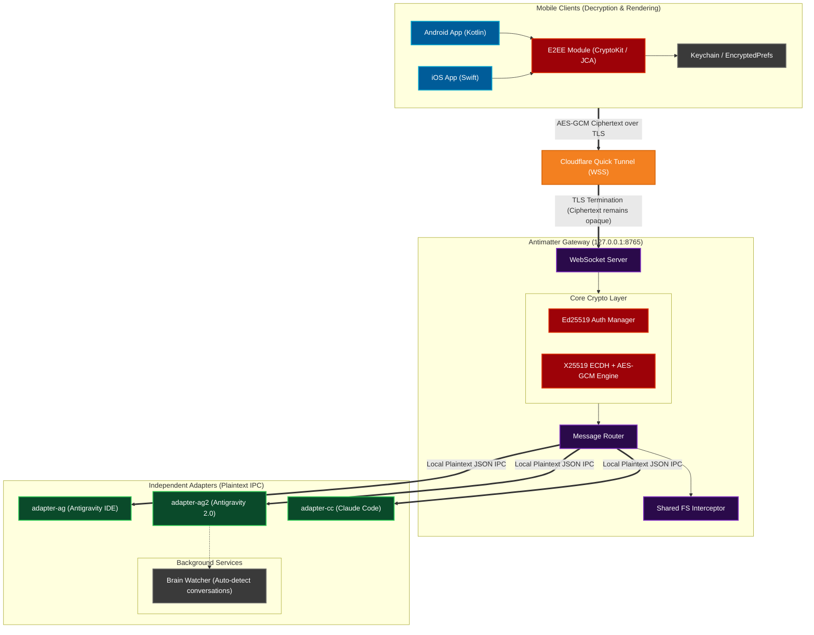

# Antimatter System Architecture

This document provides a high-level, comprehensive overview of the entire Antimatter ecosystem. The architecture follows an **Independent Adapter Model**, where a centralized **Gateway** handles zero-knowledge End-to-End Encryption (E2EE), secure WebSocket routing, and Cloudflare access, while lightweight **Adapters** run independently to connect various AI tools and IDEs.

## High-Level Component Map

## Boundary Descriptions

### 1. Mobile Clients
The iOS and Android apps act as the **sole decrypters** of the AI's output. Because the system uses E2EE, the clients do not trust the network. They use native cryptographic libraries (`CryptoKit` for iOS, `JCA` for Android) to perform Ed25519 authentication and X25519 ECDH key exchanges.

### 2. Cloudflare Network
Cloudflare acts as a Zero Trust tunnel, exposing the local Gateway to the internet. While Cloudflare terminates the TLS connection, the actual payloads passing through the WebSocket are opaque AES-256-GCM ciphertexts. **Cloudflare cannot read the AI's thoughts, code, or commands.**

### 3. Antimatter Gateway
The Gateway acts as the central hub of the user's local machine. It:
1. Validates the incoming Ed25519 signatures.
2. Performs the ECDH handshake to establish session keys.
3. Decrypts incoming `cmd:` packets and encrypts outgoing `output:` packets.
4. Routes local IPC traffic to whichever adapter the user is actively controlling.
5. Intercepts `GET_FILES` calls via `antimatter_fs` to prevent blocking the adapters' event loops.

### 4. Independent Adapters
Adapters are lightweight integration plugins (`ag`, `ag2`, `cc`). They know nothing about encryption or the internet. They simply connect to the Gateway over `ws://127.0.0.1:8765`, register themselves, and communicate using plaintext JSON IPC. This decoupling allows new integrations to be written rapidly without recreating complex networking logic.
